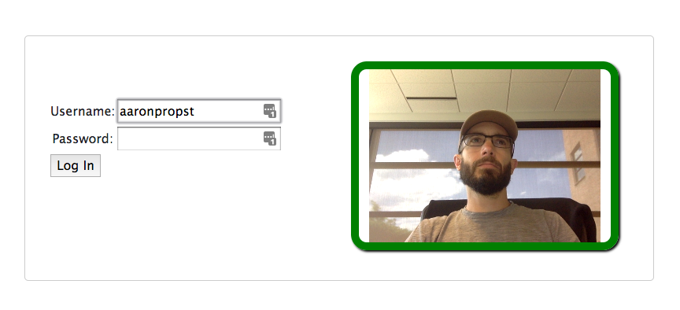
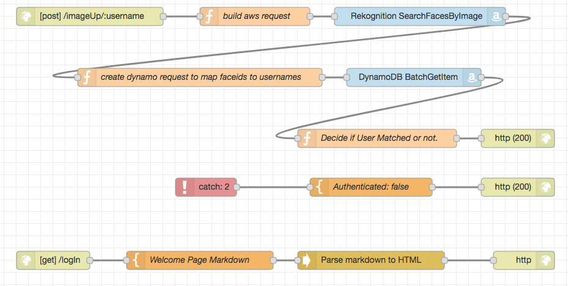

# AWS Rekognition Authentication Demo

This project is part of a company Hackathon conducted in July of 2018. 

It is based largely around this document:
https://aws.amazon.com/blogs/machine-learning/build-your-own-face-recognition-service-using-amazon-rekognition/

As well as this demo:
https://mdn-samples.mozilla.org/s/webrtc-capturestill/

The back end code is built upon [Node Red](https://nodered.org)


## Operation

### HTML5 UI


The [front end form](static/index.html) is served out of a static files directory by node red.  It waits for a user to enter a username, then begins capturing images of them via webRTC getMedia stream.  It posts image blobs every 4 seconds to the node-red backend that verifies them with AWS.

### Node-Red


The node-red backend receives the image blobs and intended username,  posts them as blobs to Rekognition using the 'SearchByFaces' api which compares a given image against a set of username indexed images.  

The node-red backend gets the face matches, verifies that they are associated with your username, and returns 'authenticated' or not.

Once 'authenticated' is true, the form is unlocked and the user may proceed with logging in.   


### Source Imagery Indexing

Source images were uploaded to s3, processed by a lambda trigger that indexes the faces in rekognition and indexes the face-id/username relationship in Dynamo.  [That indexing process is well described here](https://aws.amazon.com/blogs/machine-learning/build-your-own-face-recognition-service-using-amazon-rekognition/)

The scripts @Xiaobingliu2014 used to add images to the indexes can be found [here](indexing/)

## Caveats

In the interests of research I have piped data back to the client that it shouldn't have and if such a process were to be implemented more verification would need to take place on the back end with less trust of the client side code.

Webcam face authentication can easily be spoofed with printouts of publicly available images.  As a person can't secure their face nor change it when compromised, it's a relatively small added layer of security.  The tech is neat though!  : )

I tested this only in Chrome.

## Running the Code

You can set up and run this project locally using docker-compose.

```sh
~/code/rekoglog$ docker-compose up -d
Recreating rekoglog_hack_1 ... done
```

The docker-compose file is set up to mount your aws credentials file into the container.  You can specify aws credentials in one of the aws specific nodes to bypass that.  The flow won't function until you provide access.

### Aws Resource mappings

These are the AWS resources you'd need to run the node-red flow:

|System|Type|Name|
|---|---|---|
|Rekognition    |collection     |face_collection    |
|Dynamo         |table          |face_collection    |

These were derived largely from runnning through this guide:
https://aws.amazon.com/blogs/machine-learning/build-your-own-face-recognition-service-using-amazon-rekognition/

So doing that in your aws account should get you set up.